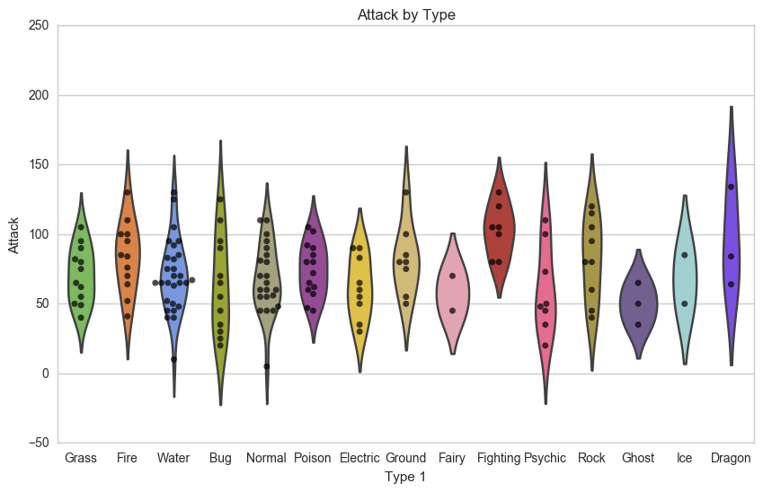
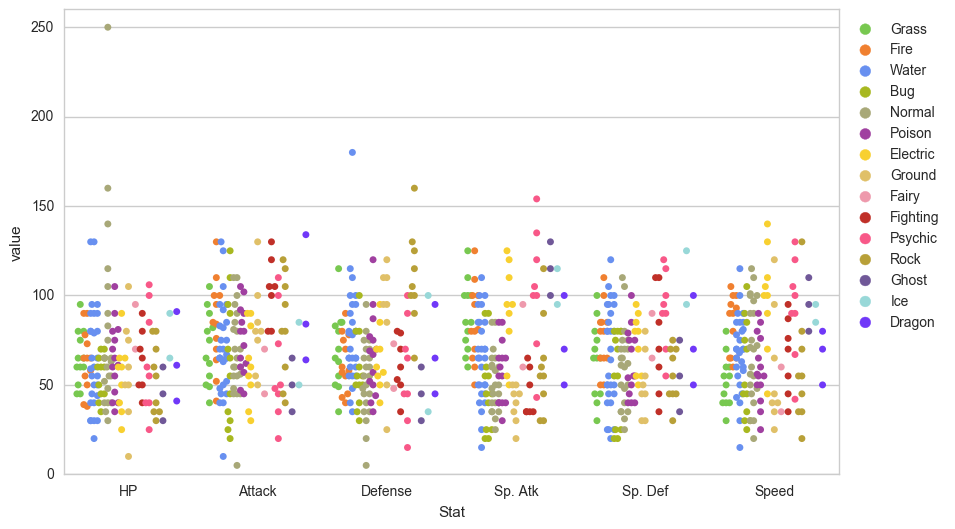

# Plotting

Given is a Pokemon csv file, describing the traits of some of the pokemon characters. Plot following 2 graphs using the above data:

1. Compare the attack ranges of Type-1 attacks. The plot should look somthing like in Figure-1.
2. Compare ther values of HP, Attack, Defense, Sp. Atk, Sp. Def, and Speed for each of the Type-1. The plot should look somthing like in Figure-2.

## Requirement

You will have to commit your changes onto a separate branch with plots images.

[ 0, 0, 1, 0, 1, 1]